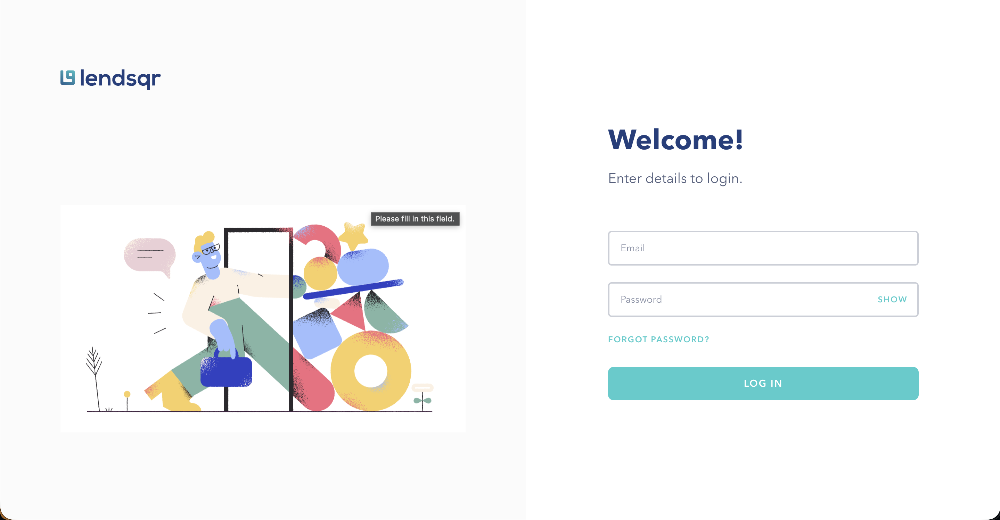
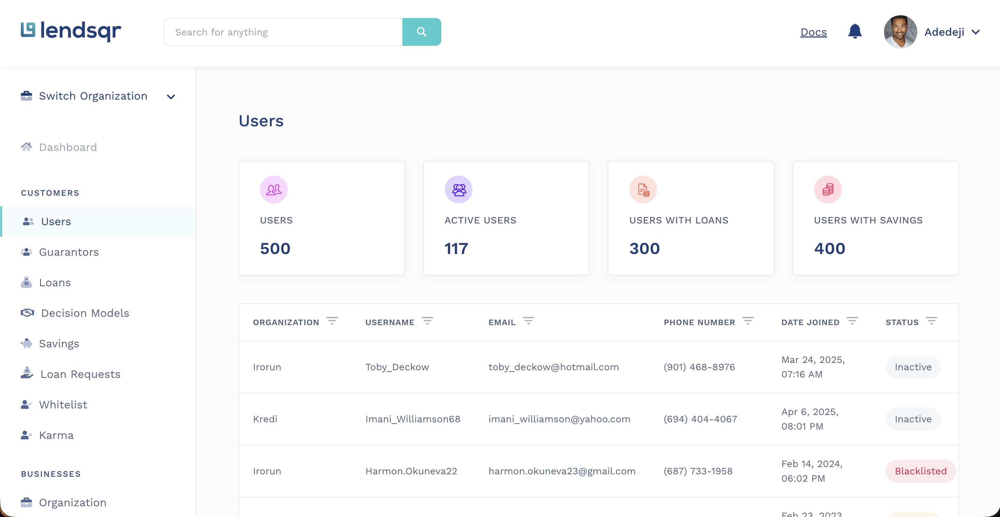
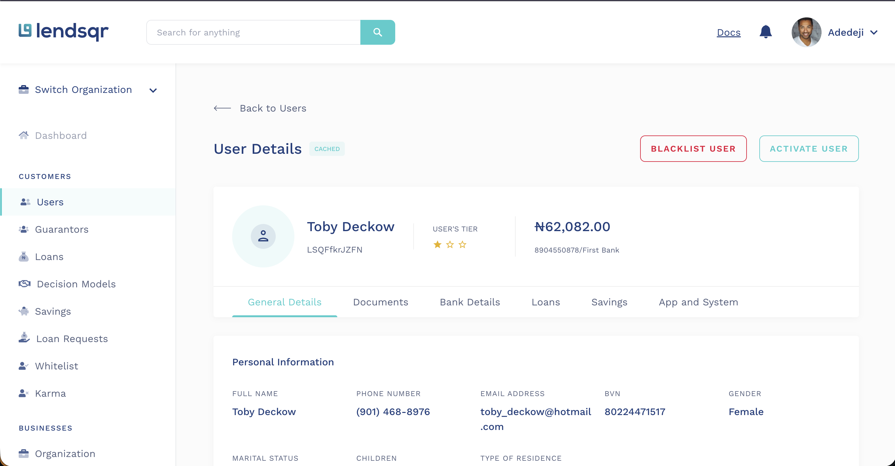
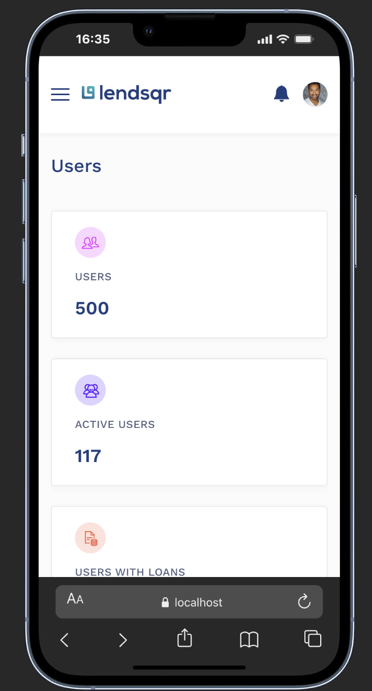
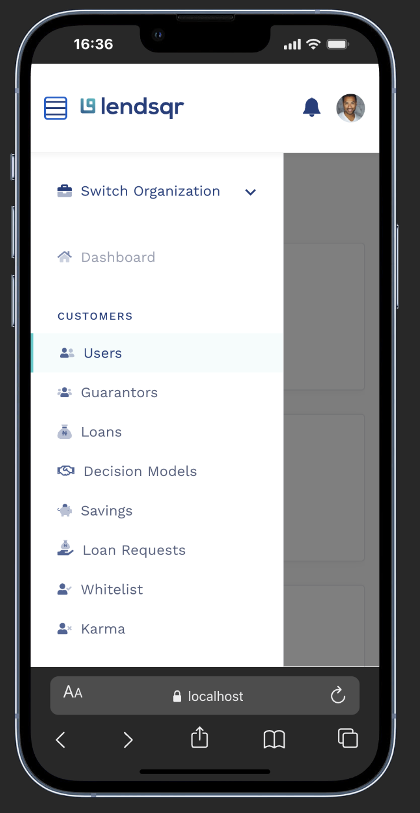

# Lendsqr Frontend Assessment

A React-based admin dashboard for managing user data, built with TypeScript, Vite, and SCSS.

## 🚀 Live Demo

[View Live Application](https://ademola-akindotuni-lendsqr-fe-test.vercel.app)

## 📋 Overview

This project is a frontend assessment for Lendsqr, implementing a user management dashboard with the following pages:

- **Login Page** - Authentication entry point
- **Users Page** - Display and manage 500 users with pagination
- **User Details Page** - View comprehensive user information

## ✨ Features

### Core Functionality

- ✅ Responsive design (mobile-first approach)
- ✅ Mock API with 500 user records using `@faker-js/faker`
- ✅ LocalStorage caching with 24-hour expiry
- ✅ Pagination with configurable page size
- ✅ User filtering by organization, status, and more
- ✅ User details with personal, education, and employment info

### UI/UX

- ✅ Clean, modern interface matching Figma design
- ✅ Mobile-responsive sidebar with hamburger menu
- ✅ Status badges (Active, Inactive, Pending, Blacklisted)
- ✅ Action dropdowns for user management
- ✅ User avatar dropdown with logout

### Testing

- ✅ Unit tests with Vitest and Testing Library
- ✅ 69 tests covering positive and negative scenarios
- ✅ Component, service, and integration tests

## 🛠️ Tech Stack

| Category   | Technology              |
| ---------- | ----------------------- |
| Framework  | React 19                |
| Language   | TypeScript              |
| Build Tool | Vite                    |
| Styling    | SCSS                    |
| Routing    | React Router v7         |
| Testing    | Vitest, Testing Library |
| Mock Data  | Faker.js                |

## 📁 Project Structure

```
src/
├── assets/
│   ├── icons/          # SVG icon components
│   └── images/         # Static images
├── components/
│   ├── DataTable/      # Table with filters and pagination
│   ├── Layout/         # Header, Sidebar, DashboardLayout
│   ├── StatCard/       # Statistics display cards
│   └── StatusBadge/    # User status indicators
├── data/
│   └── users.ts        # User type definitions
├── pages/
│   ├── Login/          # Login form page
│   ├── UserDetails/    # User profile page
│   └── Users/          # Users list page
├── services/
│   ├── api.ts          # Mock API service
│   └── storage.ts      # LocalStorage service
├── styles/
│   └── variables.scss  # SCSS variables
├── test/
│   └── setup.ts        # Test configuration
└── utils/
    └── format.ts       # Formatting utilities
```

## 🚀 Getting Started

### Prerequisites

- Node.js 18+
- pnpm (recommended) or npm

### Installation

```bash
# Clone the repository
git clone https://github.com/demolaemrick/lendsqr-assessment.git

# Navigate to project directory
cd lendsqr-assessment

# Install dependencies
pnpm install

# Start development server
pnpm dev
```

The app will be available at `http://localhost:5173`

### Build for Production

```bash
pnpm build
pnpm preview
```

## 🧪 Testing

```bash
# Run tests in watch mode
pnpm test

# Run tests once (CI mode)
pnpm test:run

# Run tests with coverage report
pnpm test:coverage
```

### Test Coverage

| Component/Service | Tests | Scenarios                                      |
| ----------------- | ----- | ---------------------------------------------- |
| Login             | 13    | Form validation, navigation, visibility toggle |
| Storage Service   | 15    | Save/retrieve, cache expiry, error handling    |
| StatusBadge       | 8     | Status rendering, CSS class application        |
| StatCard          | 11    | Props handling, number formatting              |
| API Service       | 22    | Pagination, data fetching, edge cases          |

## 📱 Responsive Design

The application is fully responsive with breakpoints at:

- **Desktop**: 1200px+
- **Tablet**: 768px - 1199px
- **Mobile**: < 768px

Mobile features:

- Collapsible sidebar with hamburger menu
- Responsive header with hidden search
- Horizontal scrolling tables
- Touch-friendly interactions

## 🔧 API Service

The mock API service (`src/services/api.ts`) provides:

```typescript
// Get paginated users
api.getUsers(page: number, pageSize: number)

// Get all users
api.getAllUsers()

// Get user by ID
api.getUserById(id: string)

// Get dashboard statistics
api.getStats()
```

## 💾 LocalStorage Caching

User details are cached in localStorage with the following features:

- **24-hour expiry** - Cached data automatically expires
- **Automatic cleanup** - Expired entries are removed on access
- **Error handling** - Graceful fallback for corrupted data

```typescript
storage.saveUserDetails(user); // Save user to cache
storage.getUserDetails(id); // Get cached user
storage.isUserCached(id); // Check if user is cached
storage.clearAllUserDetails(); // Clear all cached data
```

## 📝 Design Decisions

### Why Faker.js for Mock Data?

- Generates realistic, randomized user data
- Consistent data with seed for reproducibility
- Rich data types (names, emails, phone numbers, addresses)

### Why LocalStorage Caching?

- Reduces unnecessary API calls
- Improves perceived performance
- Persists across page refreshes

### Why SCSS over CSS-in-JS?

- Better performance (no runtime overhead)
- Familiar syntax with powerful features
- Easy theming with variables

## 🎨 Screenshots

### Login Page



### Users Page (Desktop)



### User Details Page



### Mobile View




## 📄 License

This project was created for the Lendsqr Frontend Assessment.

---

Built with ❤️ using React + TypeScript + Vite
